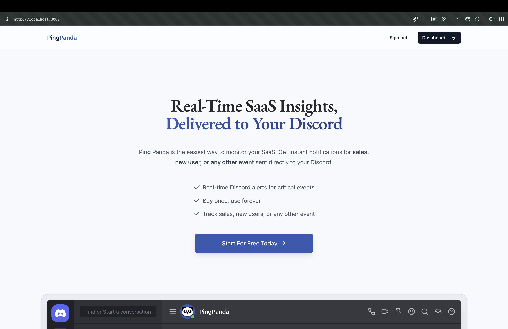
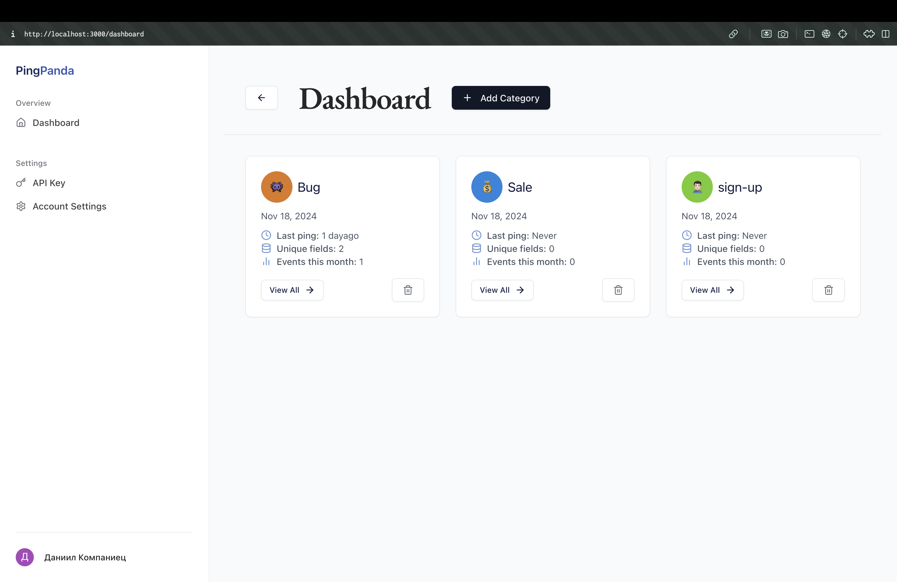
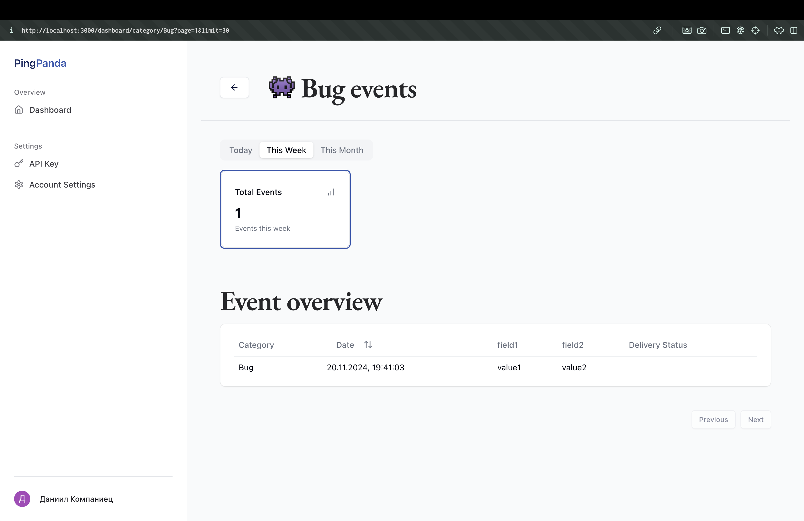
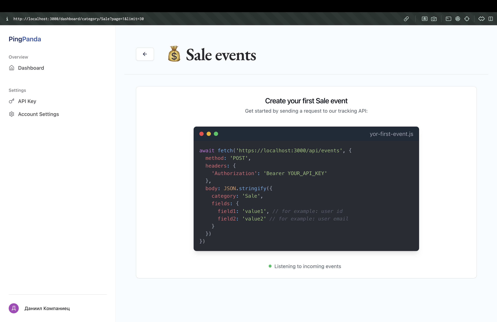
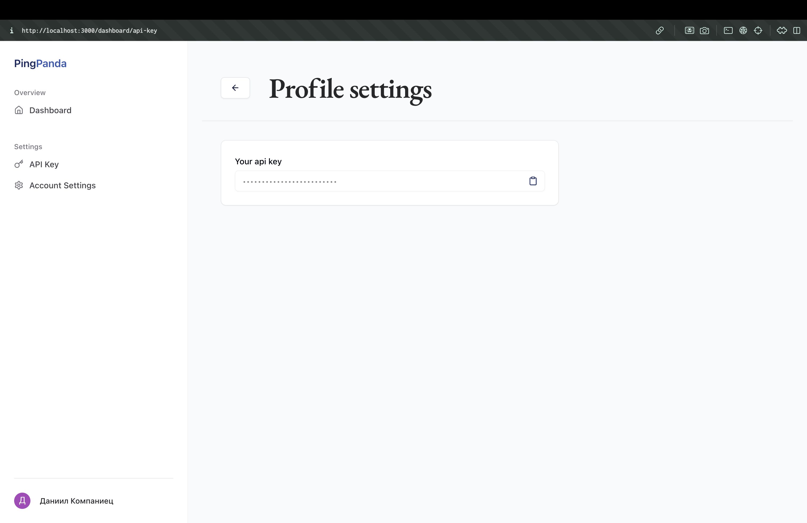

# PingPanda - Современный Fullstack-сервис для мониторинга событий

**Создан с использованием Next.js App Router, Postgres, TypeScript, Tailwind и Clerk**

## Основные возможности
- 🛠️ Полноценный SaaS на базе современных технологий.
- 💻 Красивый лендинг.
- ✉️ Уведомления о событиях в режиме реального времени через Discord.
- 🖥️ Понятная панель управления для мониторинга событий.
- 🌟 Современный интерфейс, построенный на shadcn-ui.
- 🔑 Аутентификация пользователей через Clerk.
- ⌨️ Полностью реализован на TypeScript.
- 🎁 И множество дополнительных функций.

## О проекте
PingPanda — это сервис, который решает задачи мониторинга событий, объединяя мощные технологии с удобным и интуитивно понятным интерфейсом. Решение подходит для обработки данных в реальном времени и упрощает работу как небольших команд, так и масштабных проектов.

Работа над PingPanda включает:
- Разработку чистой и удобной архитектуры backend с использованием PostgreSQL.
- Интеграцию Stripe для безопасной работы с платежами.
- Реализацию современной системы аутентификации с помощью Clerk.
- Создание адаптивного и стильного интерфейса с использованием Tailwind и shadcn-ui.

